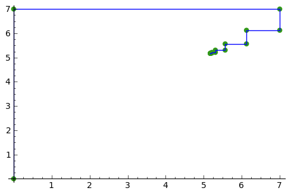
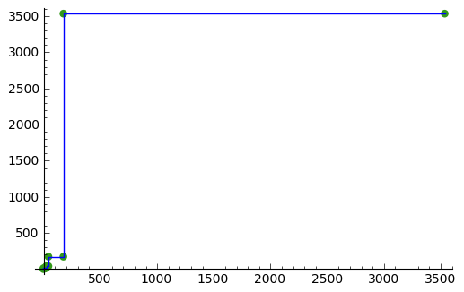
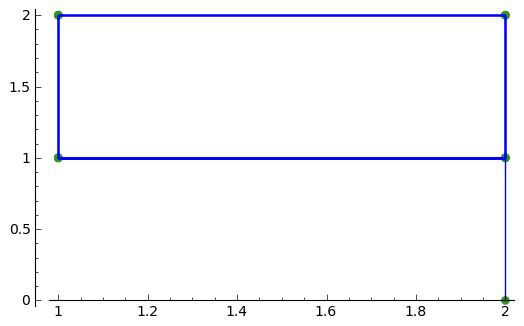
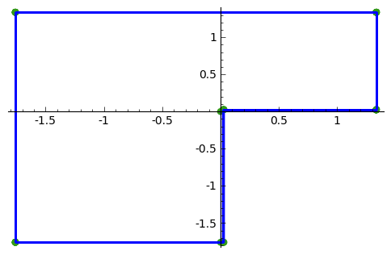

Sequences obtained by iteration of continuous real functions 
============================================================

Using SAGE for Iteration 
------------------------

This chapter tells you how to use the free and Open-Source `SAGE mathematics software <http://www.sagemath.org/>`_
for studying iteration sequences generated by iteration of continuous real functions.

To use SAGE, you first need to start the SAGE program on your computer.
You should have already installed SAGE on your computer (if not, for instructions on how to
install SAGE, see `the SAGE Installation Guide <http://www.sagemath.org/doc/installation/>`_).

This booklet assumes that the reader has some basic knowledge of iteration, 
and the principal focus of the booklet is not to explain iteration, 
but rather how to study iteration sequences using SAGE.

If you are new to iteration, and want to learn more about any of the concepts presented here, 
I would highly recommend the Open University book “Iteration” (product code MS221 chapter B1), available second-hand from from the 
`Open University Book Search <http://www.universitybooksearch.co.uk/>`_.

Plotting iteration sequences of real functions
----------------------------------------------

The iteration sequence:

.. math::

   x_{n+1} = x_{n} * (1 - x_{n}) 

(for n = 0, 1, 2, ...) is generated by the real function:

.. math::

   f(x) = x * (x - 1)

We can calculate the first 10 terms of the iteration sequence generated using function f(x), with
initial term x = 0.5, by typing:

::

    f(x) = x*(1-x)       
    p = 0.5 
    print(0,p)
    for i in range(1,10):
       newp = f(p)
       print(i,newp)
       p = newp
    # Output: 
    # (1, 0.250000000000000)
    # (2, 0.187500000000000)
    # (3, 0.152343750000000)
    # (4, 0.129135131835938)
    # (5, 0.112459249561653)
    # (6, 0.0998121667496825)
    # (7, 0.0898496981184161)
    # (8, 0.0817767298664456)
    # (9, 0.0750892963187959)

We can define a function to make a plot of successive points in an interation sequence
defined by a real function f(x):

::

    def plot_iter(f0, n, x0):
       mypoints = [] 
       var('mypoint')
       mypoint = vector([x0,0]) 
       mypoints.append(mypoint)
       for i in range(1,n):
          newx = f(x0)
          mypoint = vector([x0,newx])
          mypoints.append(mypoint)
          mypoint = vector([newx,newx])
          mypoints.append(mypoint)
          x0 = newx
       myplot = points(mypoints, rgbcolor=(0.2,0.6, 0.1), pointsize=30) + line(mypoints)
       myplot.show()

Then, to make a plot of the first 10 successive points in the iteration sequence above, using
an initial x value of x = 0.5, we can type:

::

    f(x) = x*(1-x)  
    plot_iter(f, 10, 0.5) 
    
|image0|

Another example is the iteration sequence:

.. math::

   x_{n+1} = cos(x_{n}) 

(for n = 0, 1, 2, ...). This iteration sequence is generated by the real function:

.. math::

   f(x) = cos(x)

To make a plot of the first 10 successive points in the iteration sequence above, with an initial x value of 0.0, 
we can type:

::

    f(x) = cos(x)
    plot_iter(f, 10, 0.0) 

|image1|

Finding fixed points of iteration sequences of real functions
-------------------------------------------------------------

A fixed point of an iteration sequence is a point for which the fixed point equation is true:

.. math::

    x_{n+1} = x_{n} 

That is, if the iteration sequence is generated by real function f(x), the fixed point equation is: 

.. math::

    f(x) = x

The fixed point equation of the iteration sequence:

.. math::

    x_{n+1} = x_{n} * (1 - x_{n}) 

is:

.. math::

    x = x * (1 - x) 

This iteration sequence is generated by the real function:

.. math::

    f(x) = x * (1 - x)

To find the fixed point(s), we can solve for x in SAGE by typing:

::

    solve( x*(1-x) == x, x) 
    # Output: 
    # [x == 0] 

This tells us that the fixed point of iteration sequence:

.. math::

    x_{n+1} = x_{n} * (1 - x_{n}) 

is x = 0. In this case, it happens that this is an attracting fixed point, 
and the sequence converges to the fixed point x = 0 at the limit as n goes to Infinity.

Similarly, the fixed point equation of the iteration sequence:

.. math::
    
    x_{n+1} = 0.5 * (x_{n} + (3/x_{n})) 

is:

.. math::

    x = 0.5 * (x + (3/x)) 

To find the fixed point, we can solve the fixed point equation in SAGE by typing:

::

    solve( 0.5*(x + (3/x)) == x, x) 
    # Output: 
    # [x == -sqrt(3), x == sqrt(3)]

This tells us that the fixed points are x = -sqrt(3) and x = sqrt(3). 
Here it happens that x = sqrt(3) is an attracting fixed point, and the 
sequence converges to sqrt(3) in the limit as n goes to Infinity.

Sometimes, SAGE does not give us a solution to the fixed point equation. 
For example, for the iteration sequence:

.. math::
    
    x_{n+1} = cos(x_{n})

(for n = 0, 1, 2, ...), the fixed point equation is:

.. math::
    
    x = cos(x)

If we try to solve this in SAGE, we don't get a useful answer:

::

    solve (cos(x) == x, x)
    # Output: 
    # [x == cos(x)]

In this case, we need to use the find_root() to solve the equation numerically. For example, to find
a solution to the equation x = cos(x) in the range 0 to pi/2, we type:

::

    find_root(cos(x) == x,0,pi/2)
    # Output: 
    # 0.73908513321516067

This tells us that a fixed point of the iteration sequence is approximately x = 0.739. It happens that x = 0.739 
is an attracting fixed point, and this iteration sequence will converge to x = 0.73908513321516067 in the limit 
as n goes to Infinity. 
      
Similarly, the fixed point equation of the iteration sequence:

.. math::
    
    x_{n+1} = x_{n} * x_{n} - 2.4 

(where n = 0, 1, 2...) is:

.. math::
    
    x = x * x - 2.4

To find the fixed points we solve the fixed point equation:

::

    solve( (x*x) - 2.4 == x, x)
    # Output: 
    # [x == -1/10*sqrt(265) + 1/2, x == 1/10*sqrt(265) + 1/2]

That is, the fixed points are x = -1/10*sqrt(265) + 1/2 and x = 1/10*sqrt(265) + 1/2. In this case, 
the fixed points happen to be repelling fixed points, and the iteration sequence tends to Infinity as 
n goes to Infinity.

Classifying fixed points of iteration sequences generated by real functions
---------------------------------------------------------------------------

The fixed point a of an iteration sequence generated by a function f(x) 
could be either attracting or repelling or indifferent.

The fixed point a is attracting if \|f'\(a\)\| < 1, is repelling if \|f'\(a\)\| > 1, and
is indifferent if \|f'\(a)\| = 1.

To classify a fixed point of an iteration sequence of a real function as attracting or repelling or indifferent,
we can find the gradient of the function at the fixed point.

For example, for the iteration sequence:

.. math::
    
    x_{n+1} = ((1/8) * x_{n} * x_{n}) - x_{n} + 7 

the fixed point equation is:

.. math::
    
    x = ((1/8) * x * x) - x + 7 

and we can solve it by typing:

::

    solve( ((1/8)*x*x) - x + 7 == x, x)
    # Output: 
    # [x == -2*sqrt(2) + 8, x == 2*sqrt(2) + 8]

This tells us that there are two fixed points, x = -2*sqrt(2) + 8, and x = 2*sqrt(2) + 8.

To classify these two fixed points as attracting, repelling or indifferent, we need to find the gradient
of the function:

.. math::
    
    f(x) = ((1/8)*x*x) - x + 7

at each fixed point.

The gradient of the function can be found by differentiating f(x), that is, finding f'(x):
      
::

    f(x) = ((1/8)*x*x) - x + 7
    diff(f(x)) 
    # Output: 
    # 1/4*x - 1

Therefore, we can calculate the gradient at each fixed point by calculating the value of f'(x) at each
fixed point:

::

    f2(x) = diff(f(x)) 
    f2(-2*sqrt(2) + 8)
    # Output: 
    # -1/2*sqrt(2) + 1
    f2(2*sqrt(2) + 8)
    # Output: 
    # 1/2*sqrt(2) + 1

We probably would like to round these values to three decimal places, by typing:

::

    round(-1/2*sqrt(2) + 1,3)
    # Output: 
    # 0.293
    round(1/2*sqrt(2) + 1,3)
    # Output: 
    # 1.707

That is, the gradient of the function f(x) at the fixed point x = -2*sqrt(2) + 8
is about 0.293. The absolute value of 0.293 is less than 1, so x = -2*sqrt(2) + 8
is an attracting fixed point.

The gradient of f(x) at the other fixed point x = 2*sqrt(2) + 8 is about 1.707.
The absolute value of 1.707 is greater than 1, so x = 2*sqrt(2) + 8 is a repelling fixed point; that
is, no iteration sequence generated by f(x) converges to x = 2*sqrt(2) + 8 unless x_{n} = 2*sqrt(2) + 8 
for some value of n.

Finding the interval of attraction of an attracting fixed point
---------------------------------------------------------------

If a is an attracting fixed point with an attracting fixed point a, then an "interval of attraction"
I for fixed point a is an interval containing a, for which \|f\'(x)\| < 1. 

For example, the iteration sequence:

.. math::
    
    x_{n+1} = ((1/8) * x_{n} * x_{n}) - x_{n} + 7

is generated by the real function:

.. math::
    
    f(x) = ((1/8) * x * x) - x + 7

We know from above that an attracting fixed point of this iteration sequence is x = -2*sqrt(2) + 8.

To find the interval of attraction for the attracting fixed point x = -2*sqrt(2) + 8, we need to find
the interval for which \|f\'(x)\| < 1, that is -1 < f\'(x) < 1. We can do this in SAGE by typing:

::

    f(x) = ((1/8)*x*x) - x + 7
    f2(x) = diff(f(x)) 
    solve( -1 < f2(x), x)
    # Output: 
    # [[x > 0]]
    solve( f2(x) < 1, x)
    # Output: 
    # [[x < 8]]

Thus, an interval of attraction for the attracting fixed point x = -2*sqrt(2) + 8 is (0, 8). 

This means that if we start of with an initial value of x that is within this interval of attraction,
for example, x = 0, the iteration sequence:

.. math::
    
    x_{n+1} = ((1/8) * x_{n} * x_{n}) - x_{n} + 7

will converge to the attracting fixed point -2*sqrt(2) + 8 (about 5.172). We can show this by plotting it:

::

    f(x) = ((1/8)*x*x) - x + 7 
    plot_iter(f, 10, 0.0)

|image2|

On the other hand, if we start with an initial value of x that is outside of the interval of attraction (0, 8),
for example, x = -3.5, then the iteration sequence will probably not converge. Let's make a plot to see:

::

    f(x) = ((1/8)*x*x) - x + 7 
    plot_iter(f, 8, -3.5)

|image3|

In this case, the picture shows that the iteration sequence seems to be increasing very rapidly, and probably
will tend to Infinity, as n goes to Infinity.

Finding two-cycles of an interation sequence generated using a real function
----------------------------------------------------------------------------

The numbers a and b form a "two-cycle" of a real function f(x) if: f(a) = b, and f(b) = a,
and a and b are distinct numbers.

For such a two-cycle, since f(b) = a, it is also true that f(f(a)) = a.
Likewise, since f(a) = b, it is also true that f(f(b)) = b. 

Therefore, to find the two-cycles of a real function f(x), we need to solve the two-cycle equation: 

.. math::
    
    f(f(x)) = x

For example, to find the two-cycles of the function:

.. math::
    
    f(x) = -x^2 + 2x + 1

we can type in SAGE:

::

    f(x) = -(x*x) + (2*x) + 1
    solve( f(f(x)) == x, x)
    # Output: 
    # [x == 1, x == 2, x == -1/2*sqrt(5) + 1/2, x == 1/2*sqrt(5) + 1/2]
    round(-1/2*sqrt(5) + 1/2,3)
    # Output: 
    # -0.618
    round(1/2*sqrt(5) + 1/2,3)
    # Output: 
    # 1.618

We can check the answers by seeing the values of f(x) for each of the solutions:

::

    f(1)
    # Output: 
    # 2
    f(2)
    # Output: 
    #  1
    f(-1/2*sqrt(5) + 1/2)
    # Output: 
    # -1/4*(sqrt(5) - 1)^2 - sqrt(5) + 2
    round(-1/4*(sqrt(5) - 1)^2 - sqrt(5) + 2,3)
    # Output: 
    # -0.618
    f(1/2*sqrt(5) + 1/2)
    # Output: 
    # -1/4*(sqrt(5) + 1)^2 + sqrt(5) + 2
    round(-1/4*(sqrt(5) + 1)^2 + sqrt(5) + 2,3)
    # Output: 
    # 1.618

This tells us that a = 2 and b = 1 is a two-cycle of the function:

.. math::
    
    f(x) = -x^2 + 2x + 1

In addition, x = -1/2*sqrt(5) + 1/2 is also a solution of the two-cycle equation:

.. math::
    
    f(f(x)) = x

but is not a two-cycle, as f(x) = x, that is, the iteration sequence does not cycle between two distinct values. 
This is also true for x = 1/2*sqrt(5) + 1/2.

Thus, the only proper two-cycle of the function f(x) is 1, 2.

This means that the iteration sequence:

.. math::
    
    x_{n+1} = -x_{n}^2 + 2*x_{n} + 1

generated by function f(x), will alternate indefinitely between the values x = 2 and x = 1. 
We can investigate this by plotting the iteration sequence in SAGE:

::

    f(x) = -(x*x) + (2*x) + 1
    plot_iter(f, 10, 2.0)

|image4|

In general, the solutions of the two-cycle equation f(f(x))=x are either fixed points of f(x) or
members of two-cycles of f(x).

Classifying two-cycles of interation sequences of real functions
----------------------------------------------------------------

A two-cycle a, b of an iteration sequence could be either attracting, repelling or indifferent.

If \|f'(a) * f'(b)\| < 1, the two-cycle is attracting; if \|f'(a) * f'(b)\| > 1, it is repelling;
if \|f'(a) * f'(b)\| = 1, it is indifferent; and if  \|f'(a) * f'(b)\| = 0, it is super-attracting.

To find out, we find \|f\'(a) * f\'(b)\|. For example, to find out whether the two-cycle 1, 2 of 

.. math::
    
    f(x) = -x^2 + 2x + 1

is attracting, repelling or indifferent, we type:

::

    f(x) = -(x*x) + (2*x) + 1
    f2(x) = diff(f(x))
    f2(1) * f2(2) 
    # Output: 
    # 0

Here we find that \|f\'(a) * f\'(b)\| is 0, so the two-cycle 1, 2 is super-attracting. 

This means that the iteration sequence generated by function f(x), which starts at a nearby x-value, 
is likely to converge very quickly to the two-cycle 1, 2. 

For example, if we start off with a nearby initial x-value of x = 2.5, let's see if the iteration sequence
converges to the two-cycle 1, 2:

::

    f(x) = -(x*x) + (2*x) + 1
    plot_iter(f, 30, 2.5)

|image5|

The picture shows that iteration sequence starting with x = 2.5 does indeed converge fairly quickly to the
super-attracting two-cycle 1, 2.

Finding p-cycles of a real function
-----------------------------------

Some real functions have cycles that are longer than two, for example, the cycle 

::

    x_{n+1} = x_{n}^2 - 1.76 

(n = 0, 1, 2...), where the initial value of x = 0, has a three-cycle, and so
alternates between three numbers (approximately 1.3, 0.0, and -1.8). 

A real function that cycles between p numbers is said to have a p-cycle.

To find the p-cycles of a real function in SAGE, we can define a SAGE function to
find the p-cycles for us (thanks to D. S. McNeil and John Cremona of 
`the SAGE support mailing list <http://groups.google.com/group/sage-support/browse_thread/thread/6effba6eac2c5a4b>`_).
for help with this):

::

    def iter_apply(f0, n):
       fs = [f0()]
       for i in xrange(n-1):
          last = fs[-1]
          fs.append(f0(last))
       return fs 
    def find_pcycles(f0, n):
       fs = iter_apply(f0, n)
       req = fs[-1] == x # defining equation of the cycle
       roots = req.roots(ring=RR)
       for root, mult in roots:
          yield [fi(x=root) for fi in fs] 

We can use the function find_pcycles() to find cycles of length 1 of function f(x):

::

    f(x) = (x^2) - (176/100)
    list(find_pcycles(f, 1)) 
    # Output: 
    # [[-0.917744687875782], 
    #  [1.91774468787578]]

Similarly, we can find cycles of length 2 or 3:

::

    list(find_pcycles(f, 2))
    # Output:
    # [[0.504987562112089, -1.50498756211209], 
    #  [-0.917744687875782,-0.917744687875783], 
    #  [-1.50498756211209, 0.504987562112089],
    #  [1.91774468787578, 1.91774468787578]]
    list(find_pcycles(f, 3)) 
    # Output:
    #  [[1.33560128916887, 0.0238308036295500, -1.75943209279837],
    #   [1.27545967679485, -0.133202612870383, -1.74225706392450],
    #   [-0.917744687875782, -0.917744687875783, -0.917744687875782],
    #   [-1.74225706392451, 1.27545967679486, -0.133202612870348],
    #   [-1.75943209279837, 1.33560128916886, 0.0238308036295145],
    #   [-0.133202612870345, -1.74225706392451, 1.27545967679486],
    #   [0.0238308036295096, -1.75943209279837, 1.33560128916886],
    #   [1.91774468787578, 1.91774468787579, 1.91774468787579]]

One of the three-cycles found is 0.0238308036295096, -1.75943209279837, 1.33560128916886, which
is approximately 0.0, -1.8 and 1.3, as mentioned above.

Let's plot the iteration sequence:

::

    f(x) = (x^2) - (176/100)
    plot_iter(f, 30, 0.0)

|image6|

The picture shows that iteration sequence starting with an initial value of x of x = 0.0 does indeed 
iterate between approximately 0.0, -1.8 and 1.3, in a three-cycle.

Links and Further Reading
-------------------------

Some links are included here for further reading.

For background reading on iteration, I would recommend the Open University book “Iteration” (product code MS221 chapter B1), available second-hand from from the 
`Open University Book Search <http://www.universitybooksearch.co.uk/>`_.

For an in-depth introduction to SAGE, see the `SAGE documentation website <http://www.sagemath.org/help.html#SageStandardDoc>`_.

Acknowledgements
----------------

Thank you to Noel O'Boyle for helping in using Sphinx, `http://sphinx.pocoo.org <http://sphinx.pocoo.org>`_, to create
this document, and github, `https://github.com/ <https://github.com/>`_, to store different versions of the document
as I was writing it, and readthedocs, `http://readthedocs.org/ <http://readthedocs.org/>`_, to build and distribute
this document.

Many of the examples in this document have been inspired by examples in the excellent Open University
book “Iteration” (product code MS221 chapter B1), available second-hand from from the 
`Open University Book Search <http://www.universitybooksearch.co.uk/>`_.

Contact
-------

I will be grateful if you will send me (`Avril Coghlan <http://www.ucc.ie/microbio/avrilcoghlan/>`_) corrections or suggestions for improvements to
my email address a.coghlan@ucc.ie 

License
-------

The content in this book is licensed under a `Creative Commons Attribution 3.0 License
<http://creativecommons.org/licenses/by/3.0/>`_.

.. |image0| image:: ../_static/image0.png
.. |image1| image:: ../_static/image1.png

.. |image5| image:: ../_static/image5.png

.. |image300| image:: ../_static/image1.png
            :width: 900

