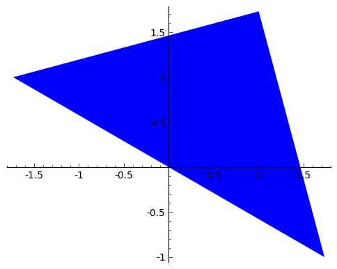
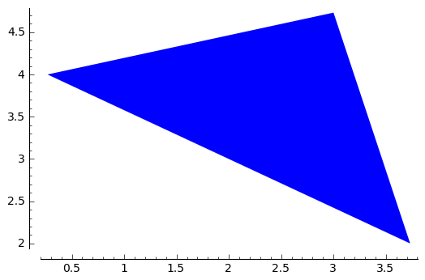
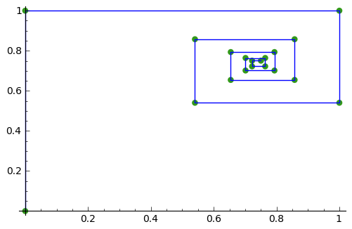

Carrying out geometric transformations using matrices
=====================================================

Using SAGE for Matrix Transformations
-------------------------------------

This chapter tells you how to use the free and Open-Source `SAGE mathematics software <http://www.sagemath.org/>`_
for studying geometric transformations using matrices.

To use SAGE, you first need to start the SAGE program on your computer.
You should have already installed SAGE on your computer (if not, for instructions on how to
install SAGE, see `the SAGE Installation Guide <http://www.sagemath.org/doc/installation/>`_).

This booklet assumes that the reader has some basic knowledge of matrix transformations,
and the principal focus of the booklet is not to explain matrix transformations,
but rather how to study matrix transformations using SAGE.

If you are new to matrix transformation, and want to learn more about any of the concepts presented here, 
I would highly recommend the Open University book “Matrix transformations” (product code MS221 chapter B2), 
available second-hand from from the `Open University Book Search <http://www.universitybooksearch.co.uk/>`_.

Vectors in SAGE
---------------

We can enter vectors a and b into SAGE by typing:

::

    a = vector([4,3])
    print(a)
    # Output: 
    # (4, 3)
    b = vector([-5,2])
    print(b)
    # Output: 
    # (-5, 2)

We can then combine the vectors algebraically, for example, we can calculate
2a + (3/2)b by typing:

::

    c = (2*a) + ((3/2)*b)
    print(c)
    # Output: 
    # (1/2, 9)

If P is a point in the plane, then the position vector p from the origin (0,0) to point P is
called the position vector of P (with respect to the origin).

For example, if we have a triangle with vertices at points (1, sqrt(3)), (sqrt(3), -1),
and (-sqrt(3),1), then we can represent the triangle by the three position vectors p1, p2 and
p3 representing these three vectices:

::

    p1 = vector([1, sqrt(3)])
    p2 = vector([sqrt(3), -1])
    p3 = vector([-sqrt(3), 1])

If we want to make a plot of a polygon (a triangle here) defined by certain position vectors,
we can type in SAGE:

::

    mypoints = list([p1,p2,p3])
    polygon(mypoints)

|image7|

We can carry out a translation of a polygon, by addition of a vector a = (p, q). For example, the
vector a = (2, 3) will move a shape two units to the right and three units up. We can apply
this transformation to the triangle above, and plot the result, by typing:

::

    a = vector([2, 3])
    mypoints2 = []
    for mypoint in mypoints:
       mypoint2 = mypoint + a
       mypoints2.append(mypoint2)
    polygon(mypoints2)

|image9|

Let's define a function to carry out a translation of a polygon, by addition of a
vector a = (p, q), and to plot the original and the tranformed polygons:

::

    def plot_translated_polygon(mypoints, a):
       g = Graphics()
       mypoints2 = []
       for mypoint in mypoints:
          mypoint2 = mypoint + a
          mypoints2.append(mypoint2)
       # plot the original polygon in blue, and the new one in green:
       g = g + polygon(mypoints) + polygon(mypoints2,rgbcolor=(1/8, 3/4, 1/2))
       g.show()

We can then use it to plot the original triangle above, and the new triangle
obtained by translating it two units to the right and three units upwards:

::

    a = vector([2, 3])
    plot_translated_polygon(mypoints, a) 

|image10|

The original triangle is shown in blue here, and the transformed one in green.

Links and Further Reading
-------------------------

Some links are included here for further reading.

For background reading on matrix transformations, I would recommend the Open University book “Matrix transformations” 
(product code MS221 chapter B2), available second-hand from from the 
`Open University Book Search <http://www.universitybooksearch.co.uk/>`_.

For an in-depth introduction to SAGE, see the `SAGE documentation website <http://www.sagemath.org/help.html#SageStandardDoc>`_.

Acknowledgements
----------------

Thank you to Noel O'Boyle for helping in using Sphinx, `http://sphinx.pocoo.org <http://sphinx.pocoo.org>`_, to create
this document, and github, `https://github.com/ <https://github.com/>`_, to store different versions of the document
as I was writing it, and readthedocs, `http://readthedocs.org/ <http://readthedocs.org/>`_, to build and distribute
this document.

Many of the examples in this document have been inspired by examples in the excellent Open University
book “Matrix transformations” (product code MS221 chapter B2), available second-hand from from the 
`Open University Book Search <http://www.universitybooksearch.co.uk/>`_.

Contact
-------

I will be grateful if you will send me (`Avril Coghlan <http://www.ucc.ie/microbio/avrilcoghlan/>`_) corrections or suggestions for improvements to
my email address a.coghlan@ucc.ie 

License
-------

The content in this book is licensed under a `Creative Commons Attribution 3.0 License
<http://creativecommons.org/licenses/by/3.0/>`_.

.. |image10| image:: ../_static/image10.png

