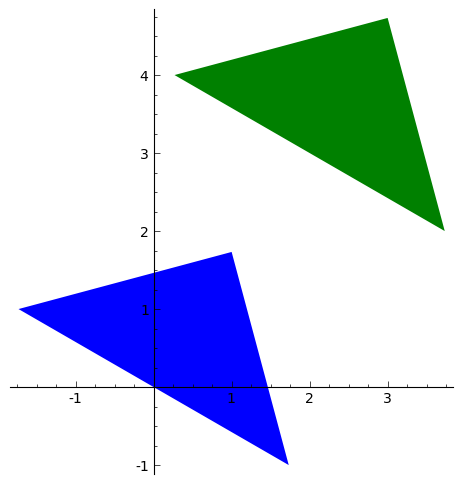
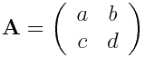

Carrying out geometric transformations using matrices
=====================================================

Using SAGE for Matrix Transformations
-------------------------------------

This chapter tells you how to use the free and Open-Source `SAGE mathematics software <http://www.sagemath.org/>`_
for studying geometric transformations using matrices.

To use SAGE, you first need to start the SAGE program on your computer.
You should have already installed SAGE on your computer (if not, for instructions on how to
install SAGE, see `the SAGE Installation Guide <http://www.sagemath.org/doc/installation/>`_).

This booklet assumes that the reader has some basic knowledge of matrix transformations,
and the principal focus of the booklet is not to explain matrix transformations,
but rather how to study matrix transformations using SAGE.

If you are new to matrix transformation, and want to learn more about any of the concepts presented here, 
I would highly recommend the Open University book “Matrix transformations” (product code MS221 chapter B2), 
available second-hand from from the `Open University Book Search <http://www.universitybooksearch.co.uk/>`_.

Vectors in SAGE
---------------

We can enter vectors a and b into SAGE by typing:

::

    a = vector([4,3])
    print(a)
    # Output: 
    # (4, 3)
    b = vector([-5,2])
    print(b)
    # Output: 
    # (-5, 2)

We can then combine the vectors algebraically, for example, we can calculate
2a + (3/2)b by typing:

::

    c = (2*a) + ((3/2)*b)
    print(c)
    # Output: 
    # (1/2, 9)

If P is a point in the plane, then the position vector p from the origin (0,0) to point P is
called the position vector of P (with respect to the origin).

For example, if we have a triangle with vertices at points (1, sqrt(3)), (sqrt(3), -1),
and (-sqrt(3),1), then we can represent the triangle by the three position vectors p1, p2 and
p3 representing these three vectices:

::

    p1 = vector([1, sqrt(3)])
    p2 = vector([sqrt(3), -1])
    p3 = vector([-sqrt(3), 1])

If we want to make a plot of a polygon (a triangle here) defined by certain position vectors,
we can type in SAGE:

::

    mypoints = list([p1,p2,p3])
    P = polygon(mypoints)
    P.set_aspect_ratio(1)
    show(P)

|image7|

Note that the set_aspect_ratio() command ensures that the scale on the x-axis and y-axis of the plot
are the same.

Translation of a polygon
------------------------

We can carry out a translation of a polygon, by addition of a vector a = (p, q). For example, the
vector a = (2, 3) will move a shape two units to the right and three units up. 

Let's write a function to apply a translation to a polygon:

::

    def translate_polygon(mypoints, a):
       mypoints2 = []
       for mypoint in mypoints:
          mypoint2 = mypoint + a
          mypoints2.append(mypoint2)
       return(mypoints2)

We can then move the triangle defined above two units to the right and three units upwards
by applying the transformation described by vector a:

::

    a = vector([2, 3])
    mypoints2 = translate_polygon(mypoints, a)

Let's plot the original triangle (in blue) and the translated triangle (in green):

::

    P = polygon(mypoints) + polygon(mypoints2,color="green")
    P.set_aspect_ratio(1)
    show(P)

|image10|

The original triangle is shown in blue here, and the transformed one in green.

Matrices in SAGE
----------------

We can enter a matrix A into SAGE by typing:

::

    A = matrix([[2,1],[3,2]])
    print(A)
    # Output: 
    # [2 1]
    # [3 2]

We can then do nice things like multiplying a vector by a matrix:

::

    a = vector([2, 3])
    A = matrix([[2,1],[3,2]])
    a * A
    # (13, 8)

Rotation of a polygon
---------------------

A rotation of a polygon, through an angle theta (radians) anticlockwise, can be obtained by
multiplying the matrix:

|image13|

by each point defining the polygon (for example, by each of the three points defining the vertices of a triangle).

This means that we can define a function to perform such a rotation of a polygon:

::

    def rotate_polygon(mypoints, theta):
       A = matrix([[cos(theta),-(sin(theta))],[sin(theta),cos(theta)]])
       mypoints2 = []
       for mypoint in mypoints:
          mypoint2 = A* mypoint
          mypoints2.append(mypoint2)
       return(mypoints2)

Let's try rotating our triangle above by pi/4 radians (45 degrees) anticlockwise:

::

    mypoints3 = rotate_polygon(mypoints, pi/4)

Let's plot the original triangle (in blue) and the rotated triangle (in green):

::

    P = polygon(mypoints) + polygon(mypoints3,color="green")
    P.set_aspect_ratio(1)
    show(P)

|image11|

Reflection of a polygon
-----------------------

A reflection of a polygon in a line through the origin that makes an angle theta measured anticlockwise from the positive x-axis,
can be achieved by multiplying the matrix:

|image14|

by each of the points that define the polygon (eg. by each of the three vertices of a triangle).

Aha! That means that we can define a function to carry out a reflection of a polygon:

::

    def reflect_polygon(mypoints, theta):
       A = matrix([[cos(2*theta),sin(2*theta)],[sin(2*theta),-(cos(2*theta))]])
       mypoints2 = []
       for mypoint in mypoints:
          mypoint2 = A* mypoint
          mypoints2.append(mypoint2)
       return(mypoints2)

For example, let's reflect the triangle with vertices at (1, sqrt(3)), (sqrt(3), -1),
and (-sqrt(3),1), through a line that makes an angle of pi/4 radians (45 degrees) with respect to the positive x-axis:

::

    mypoints4 = reflect_polygon(mypoints, pi/4)

Now let's plot the original triangle (in blue) and the transformed triangle (in green), with the line
that the triangle was reflected through (in red):

::

    P = polygon(mypoints) + polygon(mypoints4,color="green") + plot(x, (x, -2, 2), color="red")
    P.set_aspect_ratio(1)
    show(P)

|image12|

Scaling of a polygon
--------------------

A scaling of a polygon by factor a parallel to the x-axis, and by factor b parallel to the y-axis, can 
be achieved by multiplication of the matrix:

|image15|

by each of the points that define the polygon (for example, by each of the vertices of a triangle).

Let's define a SAGE function to scale a polygon like this:

::

    def scale_polygon(mypoints, a, b):
       A = matrix([[a,0],[0,b]])
       mypoints2 = []
       for mypoint in mypoints:
          mypoint2 = A* mypoint
          mypoints2.append(mypoint2)
       return(mypoints2)

For example, we can scale our triangle with vertices at (1, sqrt(3)), (sqrt(3), -1),
and (-sqrt(3),1), by a factor 3 parallel to the x-axis, and by a factor 0.5 parallel to the y-axis by typing:

::

    mypoints5 = scale_polygon(mypoints, 3, 0.5)

We can then plot the original triangle (in blue), and the scaled triangle (in green):

::

    P = polygon(mypoints) + polygon(mypoints5,color="green")
    P.set_aspect_ratio(1)
    show(P)

|image16|

Similarly, we can take the unit square, which has corners at (0,0), (1,0), (1,1) and (0,1), and
apply the scaling by factor 3 parallel to the x-axis and factor 0.5 parallel to the y-axis:

::

    p4 = vector([0,0])
    p5 = vector([1,0])
    p6 = vector([1,1])
    p7 = vector([0,1])
    mysquare = list([p4,p5,p6,p7])
    mysquarescaled = scale_polygon(mysquare, 3, 0.5)
    P = polygon(mysquare) + polygon(mysquarescaled,color="green")
    P.set_aspect_ratio(1)
    show(P)

|image18|

We see that the transformed polygon has height 0.5, and width 3.0, as expected.

Shears parallel to a line
-------------------------

As well as translations, rotations, reflections and scalings, another type of geometric transformation
is a shear parallel to a line. This is a transfomration that shifts each point parallel to a line,
through a distance that is proportional to the perpendicular distance of the point from the line.

A shear parallel to the x-axis can be achieved by multiplying the matrix:

|image17|

by each of the points of a polygon (eg. each of the vertices of a triangle). 
This is called an x-shear with factor a.

Let's define a function to carry out an x-shear with factor a:

::

    def xshear_polygon(mypoints, a):
       A = matrix([[1,a],[0,1]])
       mypoints2 = []
       for mypoint in mypoints:
          mypoint2 = A* mypoint
          mypoints2.append(mypoint2)
       return(mypoints2)

Now let's see what happens when we apply an x-shear with factor 4 to the unit square:

::

    mysquarexshear = xshear_polygon(mysquare, 4)
    P = polygon(mysquare) + polygon(mysquarexshear,color="green")
    P.set_aspect_ratio(1)
    show(P)

|image19|

Wow! Each point on the polygon has been moved to the right, parallel to the x-axis,
through a distance that is proportional to the distance of the point from the x-axis. As
a result, the two points (0,1) and (1,1) are moved far to the right, while the points
(0,0) and (1,0) stay at the same place (since they are on the x-axis).

A y-shear with factor a is a similar idea: each point is moved parallel to the y-axis,
by a distance that is proportion to the distance of the point from the y-axis. We achieve
a y-shear with factor a by multiplying the matrix:

|image20|

by each of the points of the polygon to which we want to apply the shear. 

Let's define a function to apply a y-shear with factor a, and then
apply a y-shear with factor 4 to the unit square:

::

    def yshear_polygon(mypoints, a):
       A = matrix([[1,0],[a,1]])
       mypoints2 = []
       for mypoint in mypoints:
          mypoint2 = A* mypoint
          mypoints2.append(mypoint2)
       return(mypoints2)
    mysquareyshear = yshear_polygon(mysquare, 4)
    P = polygon(mysquare) + polygon(mysquareyshear,color="green")
    P.set_aspect_ratio(1)
    show(P)

|image21|

Scaling of areas by geometric transformations
---------------------------------------------

We saw above that a rotation of a polygon can be achieved by multiplying the matrix

|image13|

by the points that define the polygon. 

Similarly, a reflection of a polygon can be achieved by multiplying the matrix

|image14|

by the points that define the polygon.

A scaling can be achieved by multiplying the matrix 

|image15|

by the points that define the polygon.

An x-shear and a y-shear are also achieved by multiplying certain matrices by the points that define the polygon.

Thus, all of these geometric transformations are achieved by multiplying some matrix:

|image22|

by the points that define the polygon. Transformations that can be described by such a 2x2 matrix
(reflections, rotations, scalings, shears) are called "linear transformations".

A useful thing to know is that the transformation will
scale the area of the polygon by a factor equal to the determinant of matrix A. 
Furthermore, the orientation of the polygon will be preserved if the determinant of A is
positive, and the orientation will be reversed if the determinant is negative.

This means that we can define a useful function that will take a matrix A
representing a geometric transformation as its input, and will tell you: (i) what
sort of transformation it is (reflection/rotation/scaling/x-shear/y-shear), (ii) by
what factor the area of the polygon will be scaled, and (iii) whether the orientation
will be preserved or not:

::

    def classify_transformation(A):
       row1col1 = A[0,0]
       row1col2 = A[0,1]
       row2col1 = A[1,0]
       row2col2 = A[1,1]
       # check if it is an x-shear:
       if (A[0,0] == 1 and A[1,0] == 0 and A[1,1] == 1):
          a = A[0,1]
          type = 'x-shear'
          print(a)
          print(type)

Links and Further Reading
-------------------------

Some links are included here for further reading.

For background reading on matrix transformations, I would recommend the Open University book “Matrix transformations” 
(product code MS221 chapter B2), available second-hand from from the 
`Open University Book Search <http://www.universitybooksearch.co.uk/>`_.

For an in-depth introduction to SAGE, see the `SAGE documentation website <http://www.sagemath.org/help.html#SageStandardDoc>`_.

Acknowledgements
----------------

Thank you to Sphinx, `http://sphinx.pocoo.org <http://sphinx.pocoo.org>`_, used to create
this document, and github, `https://github.com/ <https://github.com/>`_, used to store different versions of the document
as I was writing it, and readthedocs, `http://readthedocs.org/ <http://readthedocs.org/>`_, used to build and distribute
this document.

Thank you to Roger Cortesi for `Roger's Online Equation Editor <http://rogercortesi.com/eqn/>`_, which I used for making some of the images
of equations and matrices.  

Many of the examples in this document have been inspired by examples in the excellent Open University
book “Matrix transformations” (product code MS221 chapter B2), available second-hand from from the 
`Open University Book Search <http://www.universitybooksearch.co.uk/>`_.

Contact
-------

I will be grateful if you will send me (`Avril Coghlan <http://www.ucc.ie/microbio/avrilcoghlan/>`_) corrections or suggestions for improvements to
my email address a.coghlan@ucc.ie 

License
-------

The content in this book is licensed under a `Creative Commons Attribution 3.0 License
<http://creativecommons.org/licenses/by/3.0/>`_.

.. |image7| image:: ../_static/image7.png

.. |image13| image:: ../_static/image13.png

.. |image300| image:: ../_static/image1.png
            :width: 900

