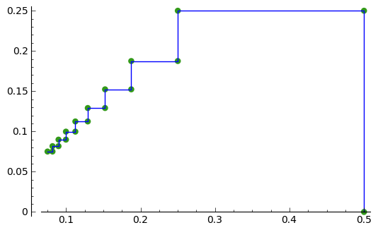
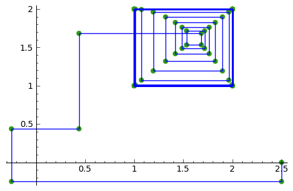

Carrying out geometric transformations using matrices
=====================================================

Using SAGE for Matrix Transformations
-------------------------------------

This chapter tells you how to use the free and Open-Source `SAGE mathematics software <http://www.sagemath.org/>`_
for studying geometric transformations using matrices.

To use SAGE, you first need to start the SAGE program on your computer.
You should have already installed SAGE on your computer (if not, for instructions on how to
install SAGE, see `the SAGE Installation Guide <http://www.sagemath.org/doc/installation/>`_).

This booklet assumes that the reader has some basic knowledge of matrix transformations,
and the principal focus of the booklet is not to explain matrix transformations,
but rather how to study matrix transformations using SAGE.

If you are new to matrix transformation, and want to learn more about any of the concepts presented here, 
I would highly recommend the Open University book “Matrix transformations” (product code MS221 chapter B2), 
available second-hand from from the `Open University Book Search <http://www.universitybooksearch.co.uk/>`_.

Vectors and matrices in SAGE
----------------------------

The iteration sequence:

.. math::

   x_{n+1} = x_{n} * (1 - x_{n}) 

(for n = 0, 1, 2, ...) is generated by the real function:

.. math::

   f(x) = x * (x - 1)

We can calculate the first 10 terms of the iteration sequence generated using function f(x), with
initial term x = 0.5, by typing:

::

    f(x) = x*(1-x)       
    p = 0.5 
    print(0,p)
    for i in range(1,10):
       newp = f(p)
       print(i,newp)
       p = newp
    # Output: 
    # (1, 0.250000000000000)
    # (2, 0.187500000000000)
    # (3, 0.152343750000000)
    # (4, 0.129135131835938)
    # (5, 0.112459249561653)
    # (6, 0.0998121667496825)
    # (7, 0.0898496981184161)
    # (8, 0.0817767298664456)
    # (9, 0.0750892963187959)

We can define a function to make a plot of successive points in an interation sequence
defined by a real function f(x):

::

    def plot_iter(f0, n, x0):
       mypoints = [] 
       var('mypoint')
       mypoint = vector([x0,0]) 
       mypoints.append(mypoint)
       for i in range(1,n):
          newx = f(x0)
          mypoint = vector([x0,newx])
          mypoints.append(mypoint)
          mypoint = vector([newx,newx])
          mypoints.append(mypoint)
          x0 = newx
       myplot = points(mypoints, rgbcolor=(0.2,0.6, 0.1), pointsize=30) + line(mypoints)
       myplot.show()

Then, to make a plot of the first 10 successive points in the iteration sequence above, using
an initial x value of x = 0.5, we can type:

::

    f(x) = x*(1-x)  
    plot_iter(f, 10, 0.5) 
    
|image0|

Another example is the iteration sequence:

.. math::

   x_{n+1} = cos(x_{n}) 

(for n = 0, 1, 2, ...). This iteration sequence is generated by the real function:

.. math::

   f(x) = cos(x)

To make a plot of the first 10 successive points in the iteration sequence above, with an initial x value of 0.0, 
we can type:

::

    f(x) = cos(x)
    plot_iter(f, 10, 0.0) 

|image1|

Links and Further Reading
-------------------------

Some links are included here for further reading.

For background reading on matrix transformations, I would recommend the Open University book “Matrix transformations” 
(product code MS221 chapter B2), available second-hand from from the 
`Open University Book Search <http://www.universitybooksearch.co.uk/>`_.

For an in-depth introduction to SAGE, see the `SAGE documentation website <http://www.sagemath.org/help.html#SageStandardDoc>`_.

Acknowledgements
----------------

Thank you to Noel O'Boyle for helping in using Sphinx, `http://sphinx.pocoo.org <http://sphinx.pocoo.org>`_, to create
this document, and github, `https://github.com/ <https://github.com/>`_, to store different versions of the document
as I was writing it, and readthedocs, `http://readthedocs.org/ <http://readthedocs.org/>`_, to build and distribute
this document.

Many of the examples in this document have been inspired by examples in the excellent Open University
book “Matrix transformations” (product code MS221 chapter B2), available second-hand from from the 
`Open University Book Search <http://www.universitybooksearch.co.uk/>`_.

Contact
-------

I will be grateful if you will send me (`Avril Coghlan <http://www.ucc.ie/microbio/avrilcoghlan/>`_) corrections or suggestions for improvements to
my email address a.coghlan@ucc.ie 

License
-------

The content in this book is licensed under a `Creative Commons Attribution 3.0 License
<http://creativecommons.org/licenses/by/3.0/>`_.

.. |image1| image:: ../_static/image1.png
.. |image2| image:: ../_static/image2.png
.. |image3| image:: ../_static/image3.png
.. |image4| image:: ../_static/image4.png

.. |image6| image:: ../_static/image6.png
.. |image300| image:: ../_static/image1.png
            :width: 900

